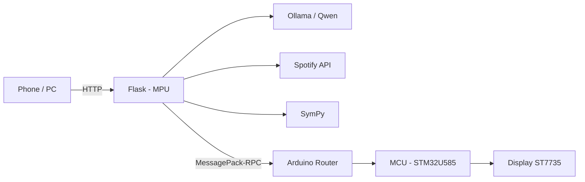
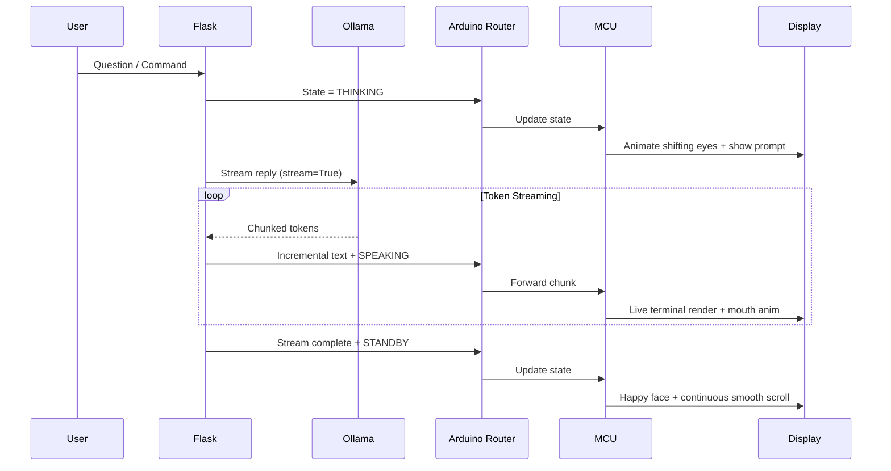
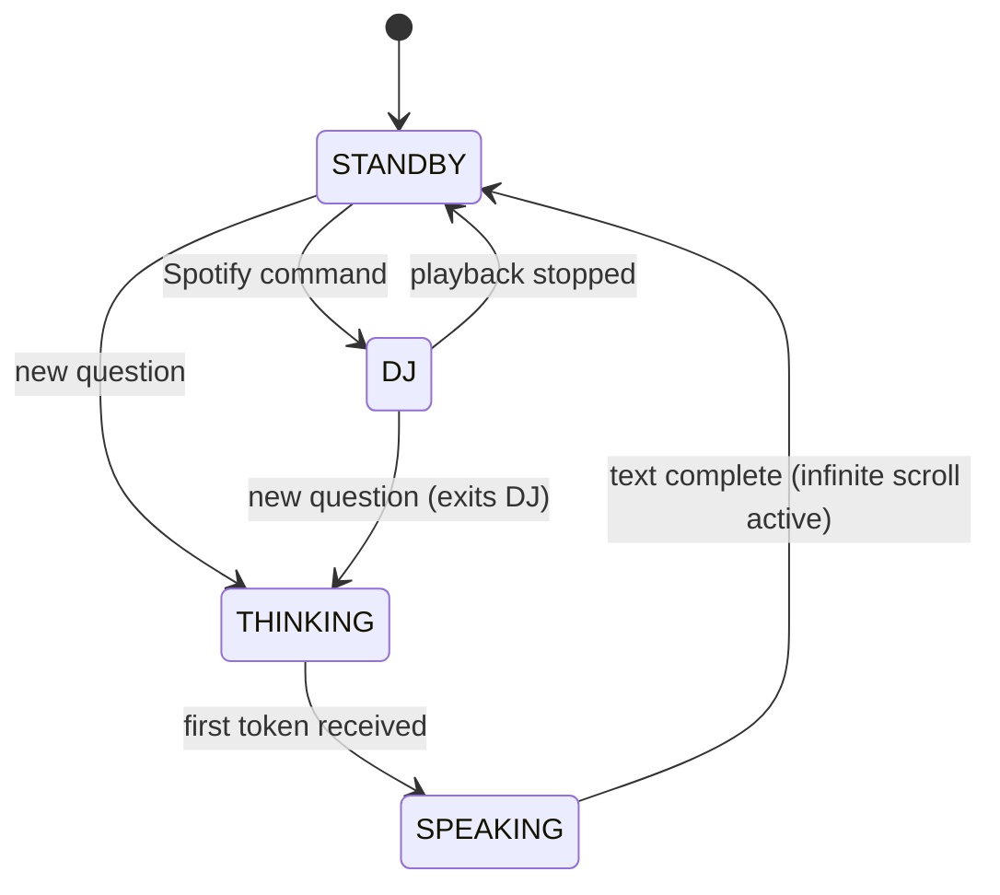

# BMO Assistant — Arduino UNO Q

Physical assistant inspired by BMO, running on the **Arduino UNO Q**. It uses a TFT display, local AI (Ollama), and Spotify integration.

> **Status:** Under development, but fully functional. Responsive dual-brain architecture with local neural inference, live token streaming, and Spotify playback control.

The board has two processors. The **MPU** runs Linux and handles the heavy lifting (Flask, Ollama, Spotify, math). The **MCU** drives the display and animations. They talk via MessagePack-RPC through the Arduino Router.



## Features

- **Local assistant** — `qwen3:0.6b` via Ollama. Behavior is controlled by `python/system_prompt.txt`. Tokens stream live to the screen as they are generated.
- **BMO face** — MCU-driven animations:
  - **Standby** — happy expression with dynamic micro-animations (blinking, glancing, winking)
  - **Thinking** — pupil-shifting animation moving left-to-right while waiting for tokens
  - **Speaking** — animated mouth opening/closing with text delivery
  - **DJ Mode** — retro cassette tape with spinning reels, equalizer, and volume display
- **Spotify control & telemetry** — track title with auto-scrolling marquee, progress bar, real-time clock, volume level (`VOL xx%`), dynamic Play (`▶`) / Pause (`||`) badges, and playback controls (play, pause, volume adjustment).
- **Persistent scrolling** — completed responses scroll smoothly and indefinitely until a new question arrives.
- **Question queue** — requests are queued in a background thread to prevent display collisions.
- **Web UI** — adjust temperature, top-p, repeat penalty, max tokens, and system prompt.

## Architecture notes

The ST7735 is driven by a custom SPI driver instead of Adafruit_GFX / TFT_eSPI. Reasons:

- Avoids library incompatibilities with Zephyr on the STM32U585
- Bulk SPI transfers reduce transaction overhead
- Scanline geometry (`fillRect`) replaces single-pixel writes, reducing SPI address window setups
- Zero-allocation scrolling engine operates by index offsets, preventing heap fragmentation
- Multi-byte UTF-8 accents are decoded once upon arrival rather than on every render frame
- Direct control for text, animations, marquee, and equalizer
- Keeps the MCU responsive while handling messages from Linux

## Request flow



## State machine



## Hardware

| Component     | Spec                  | Role              |
|---------------|-----------------------|-------------------|
| Arduino UNO Q | 2 GB RAM / 16 GB eMMC | Main processing   |
| TFT display   | 1.8", 128×160, ST7735 | BMO interface     |
| Power         | USB-C 5 V / 3 A       | Supply            |

### Display wiring (portrait, pins up)

| Display    | UNO Q | Notes                                 |
|------------|-------|---------------------------------------|
| GND        | GND   | Common ground                         |
| VCC        | 5V    | Use 5V (module has onboard regulator) |
| SCL / SCK  | D13   | Hardware SPI Clock                    |
| SDA / MOSI | D11   | Hardware SPI Data In                  |
| RES / RST  | D8    | Display Reset                         |
| DC / A0    | D9    | Data / Command                        |
| CS         | D10   | Chip Select                           |
| BLK / LED  | 3.3V  | Backlight power                       |

Wire RES to a digital pin (D8), not the board reset.

## Setup

### 1. Linux side

```bash
ssh arduino@<IP>
sudo apt update
sudo apt install -y python3-pip python3-venv
curl -fsSL https://ollama.com/install.sh | sh
```

Expose Ollama:

```bash
sudo mkdir -p /etc/systemd/system/ollama.service.d
echo -e '[Service]\nEnvironment="OLLAMA_HOST=0.0.0.0:11434"' \
  | sudo tee /etc/systemd/system/ollama.service.d/environment.conf
sudo systemctl daemon-reload
sudo systemctl restart ollama
ollama pull qwen3:0.6b
```

### 2. Python

```bash
cd python
python3 -m venv .venv
source .venv/bin/activate
pip install -r requirements.txt
```

### 3. Spotify

Create an app in the [Spotify Developer Dashboard](https://developer.spotify.com/dashboard). Set redirect URI to:

```
http://127.0.0.1:8888/callback
```

Required scopes: `user-read-currently-playing`, `user-read-playback-state`, `user-modify-playback-state`.

Put credentials in `python/.env` (do not commit this file):

```env
SPOTIFY_CLIENT_ID=...
SPOTIFY_CLIENT_SECRET=...
SPOTIFY_REFRESH_TOKEN=...
```

### 4. MCU

In Arduino App Lab, open the project, confirm files in `sketch/`, then **Run**.

### 5. App config

`app.yaml` at the project root:

```yaml
ports: [5000]
```

## Usage

Open:

```
http://<IP>:5000/
```

Examples:

```
Qual a diferença entre a ULA e a UC?
Como funciona a memória RAM?
Calcule 25 * 14 + sqrt(144)
O que está tocando?
Pause a música
Toque a música
Volume 70%
Volume 50 e me explica o que é um transistor
```

Math expressions are evaluated via SymPy. Spotify playback commands execute via direct REST calls without loading the LLM.

## Project layout

```
bmo/
├── python/
│   ├── .env                  # Spotify API credentials and secrets (gitignored)
│   ├── requirements.txt      # Python dependencies (flask, requests, msgpack, etc.)
│   ├── system_prompt.txt     # External plain-text instructions defining BMO behavior
│   ├── config.py             # System paths, constants, locks, and shared FIFO queue
│   ├── bmo_bridge.py         # MessagePack-RPC client communicating over Unix socket
│   ├── text_utils.py         # Text sanitization, regex macros, and word-wrap engine
│   ├── spotify_service.py    # Spotify REST client (playback, volume, and track polling)
│   ├── ai_service.py         # Ollama streaming client and background queue worker
│   └── main.py               # Minimal Flask web server and thread orchestrator
├── sketch/
│   ├── sketch.ino            # Main MCU firmware lifecycle, loop, and RPC registration
│   ├── sketch.yaml           # Arduino App Lab sketch profile and board parameters
│   ├── font5x7.h             # Base 5x7 ASCII bitmap font definition
│   ├── tft_st7735.h          # Bare-metal ST7735 SPI driver and geometric shapes
│   ├── bmo_text.h            # UTF-8 Portuguese accent decoder and zero-allocation scroll engine
│   ├── bmo_faces.h           # Vector face graphics (Happy, Thinking, Speaking) and idle animations
│   └── bmo_dj.h              # Cassette tape HUD, peak-hold equalizer, volume badge, and marquee
├── .gitignore                # Excludes secrets, virtual environments, caches, and build artifacts
├── app.yaml                  # Application container configuration and port exposure (5000)
└── README.md                 # Complete system documentation
```

## Common Questions

- **Can I run larger models?**
  - **2 GB RAM UNO Q:** Best suited for sub-1B models (`qwen3:0.6b`, `qwen2.5:0.5b`, `smollm2:360m`). Larger 1B+ models require swap memory and run at lower speeds (~8–15s per reply).
  - **4 GB RAM UNO Q:** Comfortably runs 1B to 3B models (`llama3.2:1b`, `llama3.2:3b`, `qwen2.5:1.5b`) without swap memory.
- **Can I use a different display?**
  Yes. Any SPI controller (e.g., ST7789, ILI9341) works by updating resolution dimensions and init commands in the sketch. I2C displays (OLED 0.91/0.96) must be wired to SDA/SCL or the Qwiic port using an SSD1306 driver instead.
- **Can I add voice and audio?**
  Yes. An I2S microphone (INMP441) or USB-C mic can be added on Linux alongside wake-word detection (`Keyword Spotting`). Audio output can be driven via an I2S DAC (MAX98357A) or USB-C audio with a lightweight local TTS engine like Piper.

## For errors or questions, contact me

- **LinkedIn:** [https://www.linkedin.com/in/pablo-rubens-6498252ab/](https://www.linkedin.com/in/pablo-rubens-6498252ab/)
- **Instagram:** [@pablorm9](https://www.instagram.com/pablorm9/)
- **Email:** [pablomoura164@gmail.com](mailto:pablomoura164@gmail.com)